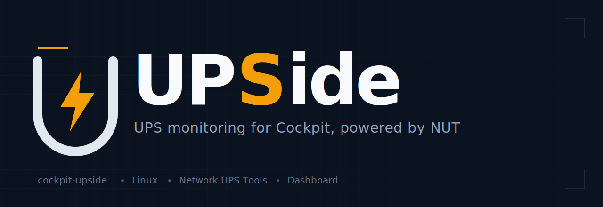

<p align="center">
  
</p>

# UPSide

UPS monitoring for [Cockpit](https://cockpit-project.org/), powered by
[NUT (Network UPS Tools)](https://networkupstools.org/).

UPSide is a Cockpit plugin that surfaces the state of one or more UPS devices
managed by NUT — battery charge and runtime, line/load status, input/output
voltage, and the other variables exposed by `upsd` — directly in the Cockpit
web console.

> **Status:** early scaffold. Built on the official
> [cockpit-project/starter-kit](https://github.com/cockpit-project/starter-kit)
> (React + PatternFly + esbuild). Monitoring-first; the dashboard is under
> construction.

## How it works

The plugin is a read-only client of a running NUT setup. It uses Cockpit's
`cockpit.spawn()` channel API to call `upsc` locally — enumerating UPSes with
`upsc -l`, then reading each one's variables with `upsc <name>` — and renders
them with PatternFly. It does **not** drive the UPS hardware directly, and it
runs no backend service of its own: NUT's `upsd` is the backend.

A working NUT installation (`nut-server` + `nut-client`, with at least one UPS
configured in `ups.conf`) is therefore a prerequisite.

### Multiple UPSes

UPSide is multi-UPS from the ground up. NUT addresses devices as
`name` (or `name@host`), so the data layer is modelled as a list of devices:

- an **Overview** page shows a card per UPS (status badge, battery %, runtime,
  load) — the all-at-a-glance view;
- a **Detail** view drills into a single UPS (battery gauge, voltages, load,
  full variable table), with a UPS selector to switch between devices.

A single-UPS install simply shows one card and one detail view.

## Requirements

- Cockpit
- NUT (`upsd` running, at least one UPS configured in `ups.conf`)

## Development

```sh
npm install        # install build/runtime deps
npm run watch      # rebuild dist/ on change (esbuild)
```

To try it in a local Cockpit, symlink the built plugin into your user's
Cockpit package path:

```sh
mkdir -p ~/.local/share/cockpit
ln -s "$(pwd)/dist" ~/.local/share/cockpit/upside
```

Then open Cockpit and find **UPSide** in the sidebar. See
[`CONTRIBUTING.md`](CONTRIBUTING.md) for the full setup, conventions, and how
to run the tests.

Lint:

```sh
npm run eslint
npm run stylelint
```

## Roadmap

- [ ] NUT data layer: `upsc -l` enumeration + per-UPS polling via `cockpit.spawn`
- [ ] Overview page (card grid, status badges)
- [ ] Detail view with battery/load gauges (PatternFly charts) + variable table
- [ ] UPS selector ("tenant" switch) between devices
- [ ] Live updates via interval polling (NUT has no push model, so polling is
      the idiomatic approach) + short in-memory window for sparkline trends
- [ ] Historical data — decide between reusing **PCP** (what Cockpit's Metrics
      page uses, already deployed in some environments) and a self-contained
      sampler (`upslog`/sqlite/RRD)
- [ ] Remote `upsd` support (`name@host`) for monitoring UPSes on other hosts
- [ ] Surface a compact UPS health card on Cockpit's system **Overview** page
- [ ] (later) Control actions — battery test, etc. — gated behind privilege

## Contributing

Contributions are welcome! See [`CONTRIBUTING.md`](CONTRIBUTING.md) and our
[Code of Conduct](CODE_OF_CONDUCT.md). Bug reports and feature requests via
GitHub Issues.

## License

[LGPL-2.1-or-later](LICENSE), matching Cockpit and the starter kit it is
based on.
